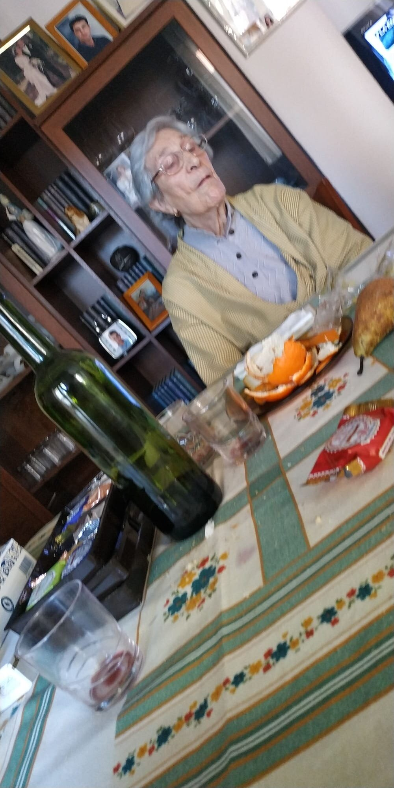

---
hide:
    - toc
---

# **WEEK O1**
## **Bootcamp**

### WHAT'S YOUR FIGHT?
While thinking about this question I thought about myself as an individual and I found that I didn’t have a really remarkable fight.

There is a myriad of remarkable fights that are worth fighting for: climate change, loss of biodiversity or others that come to my mind. And I am really worried about the former. I have investigated climate change and refugees, the north and the south global, and the negative impact that the former provokes on the latter. But I don’t feel a real connection with that, nor I did when I started environmental engineering back in my first choice to go to college when I was 17. I feel that this was a fight that needed to be fought, but not by me. I think about that more like a global mission in which I’m involved rather than a personal one. 

Then, I started to think smaller and with more tangible objectives, and I didn’t find any special topic that I could define as my own fight, except my own survival.

After hours and days of feeling like a very static person because of that, I started thinking about replanning the question. What things are you most related to? And so many memories came to my mind. I remembered my family and friend meetings, around the table, and our behavior and habits in these kinds of events: The food, my grandmother, the games we played in the “sobremesa” time after lunch… 

I never thought about myself as a very traditional person, but recalling memories about my family meetings made me understand the main role tradition plays in life. When we feel out of our comfort zone we go for nostalgia, and that’s where tradition might take place for me. 
I find myself at a crossroads: should I discard the previous thoughts because they came to my mind only to hold on to something I know or are these thoughts a good entry for something else?

On this photograph taken on Christmas in 2020, I was at my grandmother’s home staying at the table after lunch chatting and drinking. The photograph makes me feel like we are a stereotypical Spanish family. Stereotypes are built upon repetitions and habits and they express good and bad qualities around the model they represent. At the time this model iterates enough times it can mutate by idealization into an archetype. In design, we recognize archetypes about almost all objects. These archetypes are constructed by a good design in itself and their repetition during history. We all have an image of what things should be or at least how many elements these things have.

Going back to my grandmother’s photograph I found a little thing that surprise me. She designs a photo frame using her little clock. This clock has a perfect size, inclination angle and shapes to attach my grandmother’s photograph. This frame was a non-intentional design, an object that works behind its use. 
