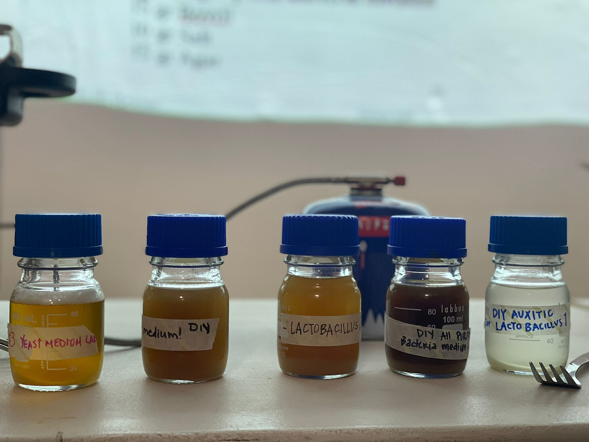
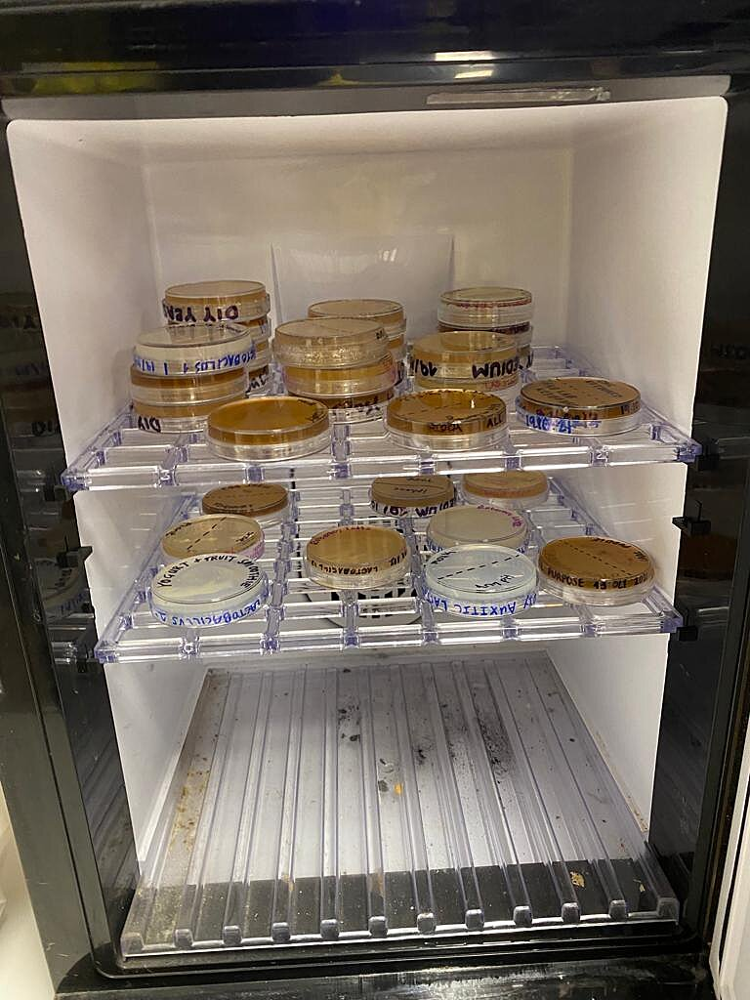
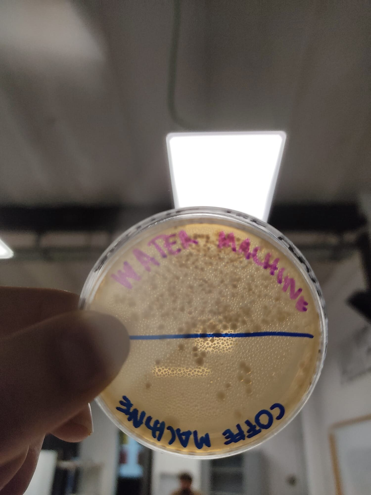
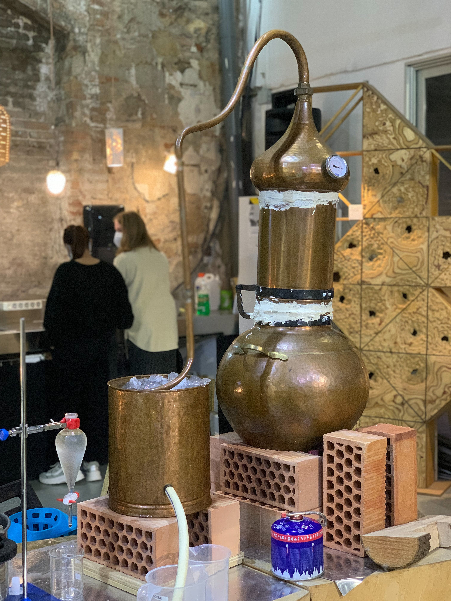
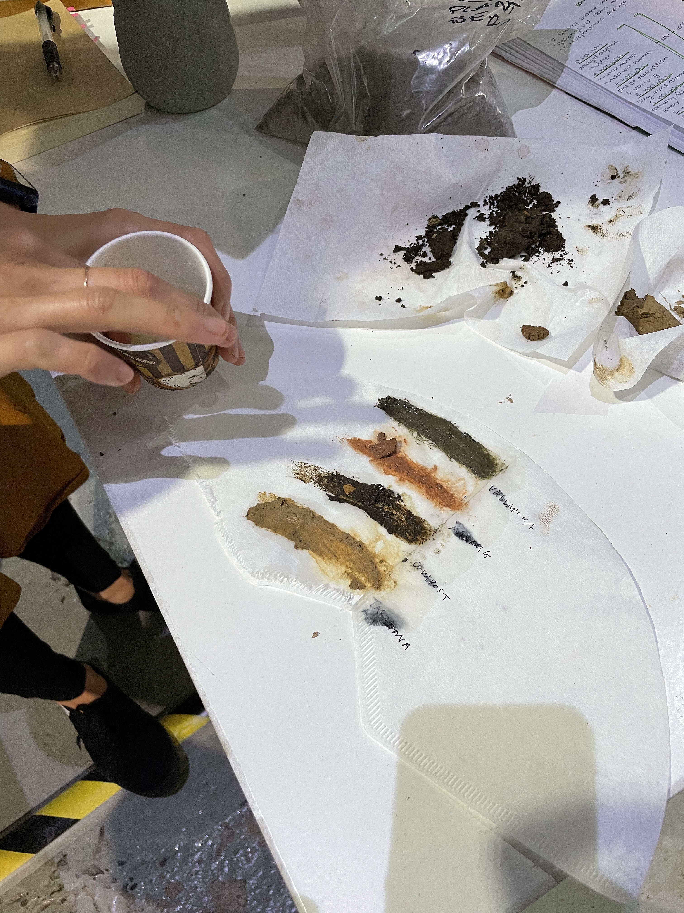
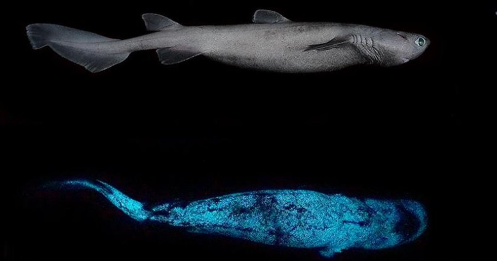
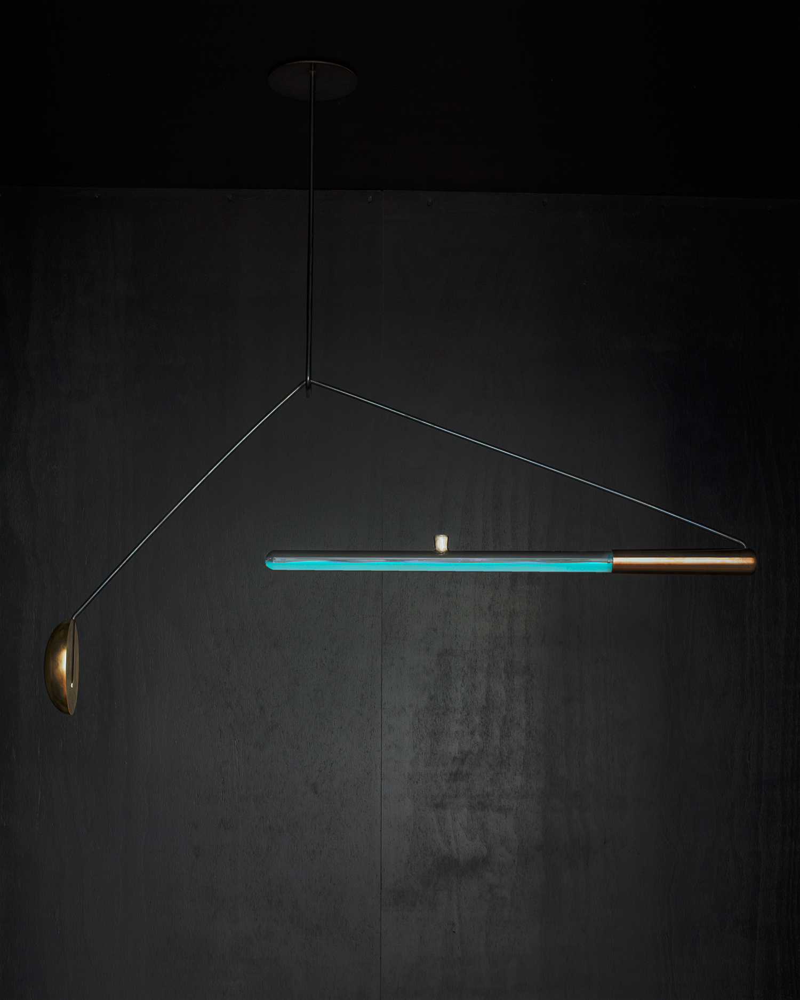
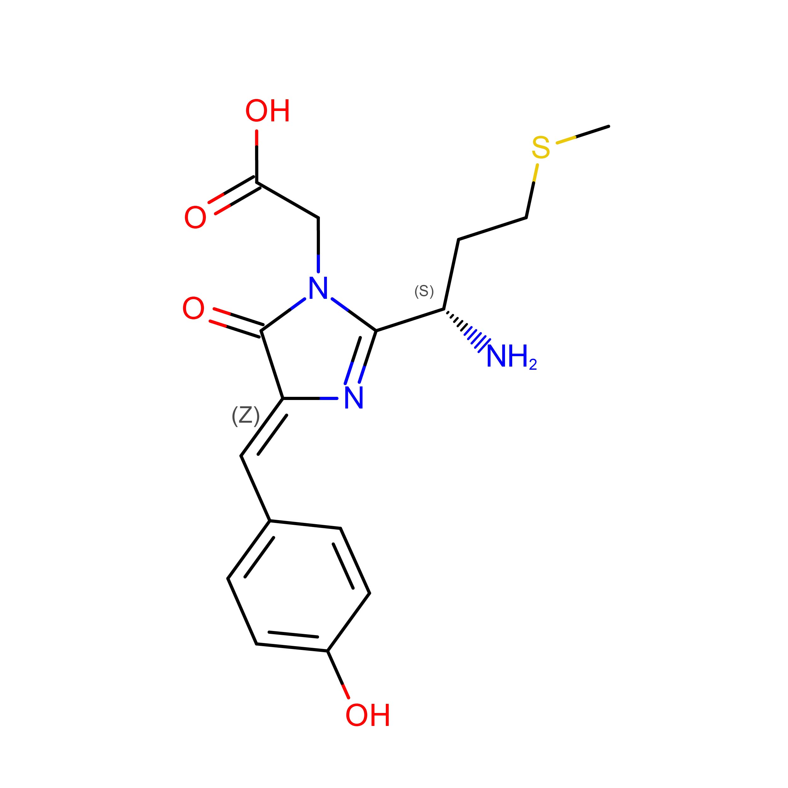
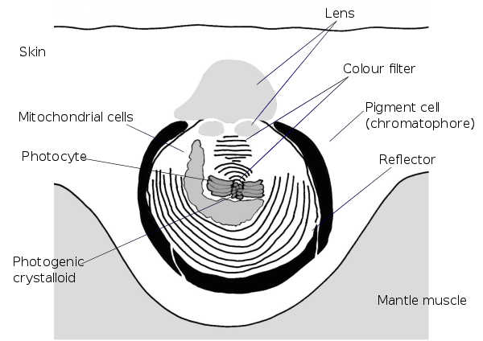

---
hide:
    - toc
---

# Bio&Agri Zero

A week in photographs

Science paper
**Bioluminescence of the Largest Luminous Vertebrate, the Kitefin Shark, Dalatias licha: First Insights and Comparative Aspects**

**Jérôme Mallefet, Darren W. Stevens and Laurent Duchatelet**

In this paper the authors studied the bioluminescence in three species of deepwater sharks. The dissertation describes the bioluminiscence’s causes, how these shark’s cells can produce light, and the ability of those species to control light emission. 

The main reason attributed to bioluminescence is Counterillumination, with some exceptions like aposematism, and conspecific recognition. 

Luminescence is achieved by an amount of photophores that are located in the epidermis. Each organ –photophore– is made of an aggregate of photocytes. Photocytes are photogenic cells where a biochemical reaction takes place, and are covered with a layer of pigmented cells. The reaction starts with the molecule luciferin’s oxidation by an enzyme, the luciferase, or through a stabilized complex called photoprotein. Photophores also display an iris-like structure (ILS) composed of chromatophores between the photocytes and the lens cells.

The interesting part arrives when the light changes by hormonal control. In this experiment the authors test the effect of MT (melatonin), α-MSH and ACTH in the light changes. Also Prolactin triggers light in one of the species. 

The trial was done by immersion of skin patches in different concentrations of the different hormones. The hormone MT increases the light and the α-MSH and ACTH make inhibitory actions to the light. Luminescence was measured using FB12 tube-luminometer and the lights emissions were recorded through a multiple kinetics software. 

Since Edison created the first commercially practical incandescent light, our lives are attached to the light, increasing our time awake and improving our lives in different ways, but do we need that all those lights came from non-renewable resources? Is it possible to apply this literacy to redesign our habits? Can we interact with other species in the domestic space? 

Ambio- Teresa van Dongen

**Design a mutant**iGEM

I started with one simple question: **It’s possible to use photocytes or photoproteins to use them on screens?**

When I was looking in the background research phase I found that some scientifics had developed LED´s with fluorescent proteins “to use as a backlight source for liquid crystal (LC) displays”. Those proteins are eGFP (green fluorescent protein) and mCherry (red fluorescent protein). “The expression and purification of the proteins were done in six
steps, which were: transformation, induction, cell harvest, lysis, purification and concentration.” After that, they integrated these proteins on blue LED chips to generate white light.  

mCherry

It's interesting how this biotechnological progress allows us to improve different aspects of life. Using fluorescent proteins in LEDs reduces e-waste but, Can we make biodegradable light in all of its aspects?

**Hypothesis: Through 3D impression it's possible to print a luminous organ and control light with a hormone system.**

A photophore is a glandular organ that appears as luminous spots. Taking a sample of this organ from the corresponding animal and cultivating the different cells from this organ, I will be able to print in 3D replicating the same structural characteristics and functions of the organ sample. 

In order to improve the emission of light, I can modify the genes that are responsible for synthesizing the photoproteins by CRISPR Cas9. 

Through an array with the modified cells from this organ, I 3D print it. This new organ in an appropriate environment could be modified with a hormonal system with MT, α-MSH, and ACTH. This hormonal system immerses the organ in a specific concentration of each hormone in order to “turn off”, “turn on”, and change the light intensity. 

References: 

Press DA, Melikov R, Conkar D, Firat-Karalar EN, Nizamoglu S. Fluorescent protein integrated white LEDs for displays. Nanotechnology. 2016 Nov 11;27(45):45LT01. doi: 10.1088/0957-4484/27/45/45LT01. Epub 2016 Oct 7. PMID: 27713186.

Shaner, Nathan C; Steinbach, Paul A; Tsien, Roger Y (2005). A guide to choosing fluorescent proteins. , 2(12), 905–909. doi:10.1038/nmeth819

https://www.the-scientist.com/news-opinion/on-the-road-to-3-d-printed-organs-67187

