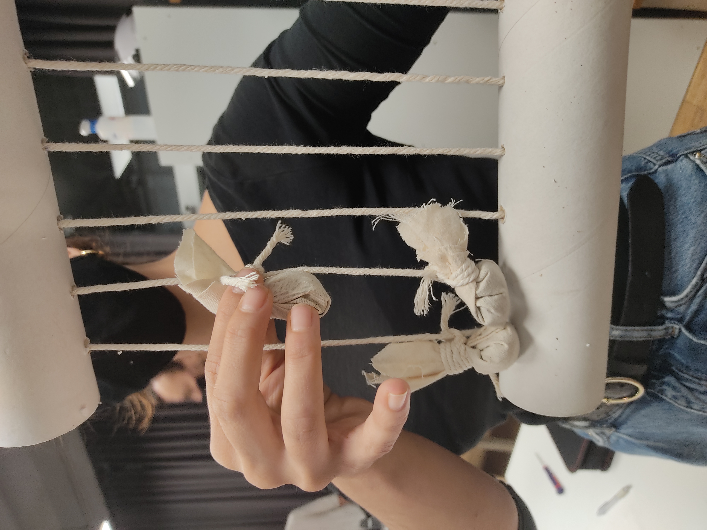
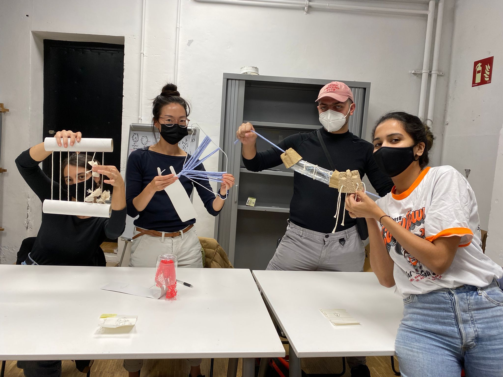
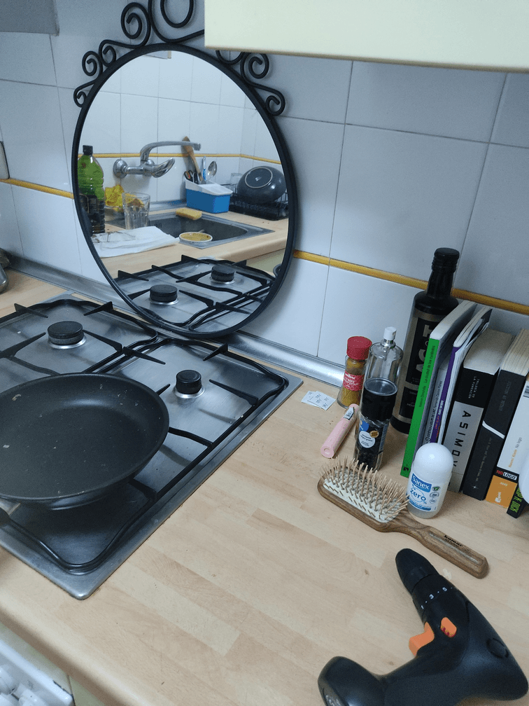

---
hide:
    - toc
---

# Living with your own ideas

First approach; *do a magic object*

New ways to sense the time, use smells to perceive the time. 

Metahuman group prototypes. 

**MAKE IT WEIRD MAKE IT STRANGE - 
DEFAMILIARIZATION OF SPACE AND THINGS**

*Experimental day*

- Put things that “belong” to one space into another. *“The form that is perhaps most appropriate to the weird is montage-the conjoining of two or more things which do not belong together”. “The conviction that this does not belong- is often a sign that we are in the presence of the new”* - Mark Fisher, The weird and the eerie. 
- Use things in an appropriate way. 
- Hybrid objects. Some “things” that represent the way social elements and natural elements mix and blend in the modern era. 

**Defined study boundaries, describe the limits of the study.**

At first I tried to make a defamiliarization of the domestic things, so I thought that things were my point, but when the day started I realized that the spaces where I placed the “new” things also were affected because the actions I played with the objects. Also I thought only about domestic things but it changed when I started thinking about bringing outside things as domestic ones. So finally the experiment blurred the limits by itself. 

**Authenticity, construct validity, being personally involved.**

I lived one day in an upside down home, all activities changed and I prefered just taking some photos and short videos in order to not change these activities because of the documentation. 

In some moments I forgot that I was in the middle of an experiment and found myself looking for things in the wrong place and sometimes reality just came into my mind and I realized that I was reading on the sink or eating surrounded by plants. 

**Plausibility or scholarship, it relates to current research, trends…**

People's behaviour is very related to the things that surround themselves. Design and adding new technologies in domestic spaces have an impact in people's lives, so it's important to remember our habits and feel those rituals or things that we normally don't notice. 

Also the experiment brings me the opportunity to see how I pack things. What are the links between things and why?. I put one thing out of context and by using this thing some other things appear around the first object I put. I noticed that the objects built a network and I could see it by making this network obvious. 

**Criticality, instrumental utility, imagining ways of thinking and acting differently.**

I think this experiment can be done in several ways, the three ways I played and so many others, make things strange by mixing them, put in the outside some from the inside… 

**Self-revealing communication, communicate in an open and transparent way without filtering or changing what happened.**

In the video I didn’t show all the things that happened because I was really into the experiment and forgot to document all the actions I made. But I analyzed those actions after the experiment in a more theoretical way.   

**Ethnographic material with confessional content, personal material to be limited to relevant information in relation to the research subject.**

I am embodied in research about data, habits, things and consumerism so I chose this experiment in order to give some clarity to the theoretical research I had been doing until this point. To experiment some ways where I could start to design and challenge the theory that I already study. Absurdity and new relations between things were already some topics that I wanted to explore. I think that some Insights are going to help me a lot in the future. 

**Generalizability, does it relate to others?**

I think that it can be meaningful to others because “things” or objects were not a close space. Waste and the ways we waste are also habits related to things. Also it’s important the behaviour we have and in which spaces. As I study domestic spaces and our relations with it other people study public space and our relations with it, so there is a connexion between both.  

