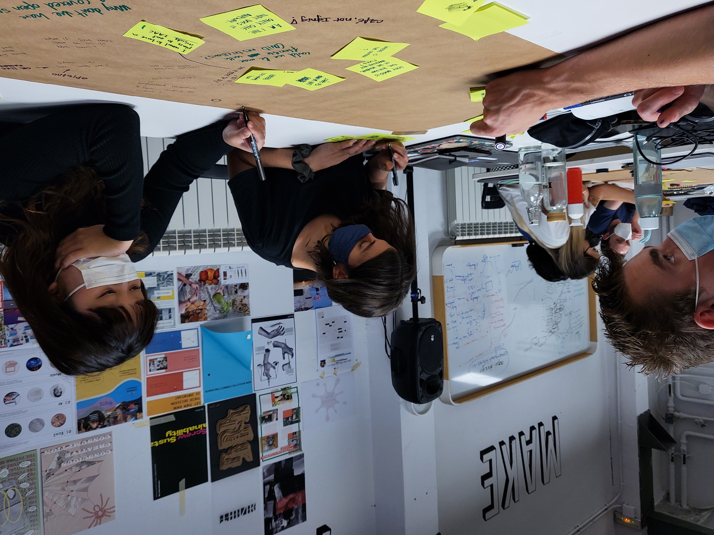
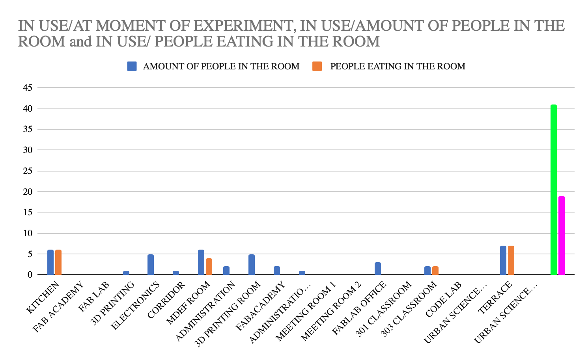
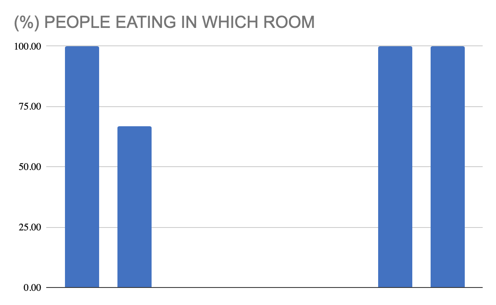

---
hide:
    - toc
---

# Tech beyond the myth

**Forensic Reports**

Forensics of the Obsolescence (iMac2006)

**serial number:**  CK6s0083WH4

**Brand:** Apple (in California)

**Model:** A1195 apple computer

**Color:** White

**Assembled in:** China

**Specifications:** 1.83/2x512/160 combo/Esp 2006
 
**Tested:** Working

**Forensic Questions**
It is a personal computer , used for personal work  like word processors, it has a camera and microphone built in, for video calls for example, and also has a pair of speakers for sound reproducing.
This model has an optical unit or CD/DVD ROM that can reproduce and burn cd/dvd. This could be used for playing videos or movies.
This computer has a WIFI modem, so it can be connected to the internet.
It had an Intel processor and 8 GB of RAM. It have a monitor and  3 USB ports, 2 input/output for audio and video, and Ethernet port
This device could be used for personal use or work.

**Conclusions**

It was all different kinds of functions and its parts combined in one box. Each functional part was connected to the motherboard with plugs in.

Most of the parts are made by different suppliers. 

Camera, speakers, disc utility, microphone, and hard drive are easy to recognize. 

When we accidentally dropped the CPU to the floor, it bent and was unable to be used again. Some parts are really fragile when it's open.

There are more than 100 screws used inside.

Most of the metal parts are aluminum. Metals are both manufactured by stamping, the stand might be molded. 

Plastic parts(box) are coated polycarbonate.

Everything except the screen is covered with an aluminium sheet in order to avoid heat and radiation.

Some screws are hidden and some parts are glued so that Apple technical support will be able to know if a user opens the computer by themself so that Apple will not support it anymore.

**A World in Data**

**Project Objective:** We want to have a place to eat lunch inside IAAC

Question: Are all spaces at IAAC in use during the lunch time?

Hypothesis: - Lunch&Afternoon Data “There is a space for a (covid-safe)
lunch?” - Morning Data “Are there people in Iaac interested in having a
space to have lunch?”

**Recollecting Data**
We used the PiCamera to record Iaac spaces in two different ways: 

1. The camera was taking pictures while we moved around the different spaces of IAAC. 
2. Static timelapse: the camera was place in the entrance and captured everything that happened there.
For the camera settings, we decided to use a low resolution (320x240px).

Poster at the entrance to see how people react. 

Data summary

**Almost useless machine: A3P2**

The whole is greater than the sum of its parts. In A3P2 we worked to develop the structure, the mechanics, and the code according to our skills and the short amount of time we had to design the prototype. Assembling the pieces I realized that the vertical movement or the light system with fiber optics in which I’d been immersed were more than only mechanics and materials, they were a system. Once we had the robot working we couldn't stop projecting human skills to it. At first, we design a machine to feel an emotion by using it, but in the end, I feel that we design a machine to express this emotion. 

<iframe src="https://player.vimeo.com/video/650292328?h=a64379c3d8" width="640" height="360" frameborder="0" allow="autoplay; fullscreen; picture-in-picture" allowfullscreen></iframe>

<a href="https://vimeo.com/650292328">A3P2.mp4</a> from <a href="https://vimeo.com/user30409675">paula del rio arteaga</a> on <a href="https://vimeo.com">Vimeo</a>.

Presentation

