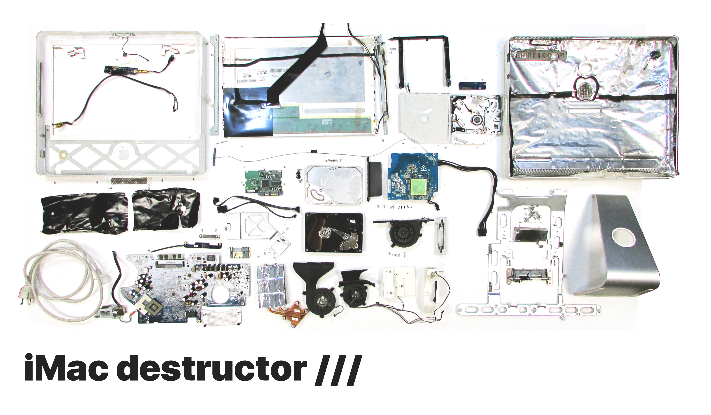
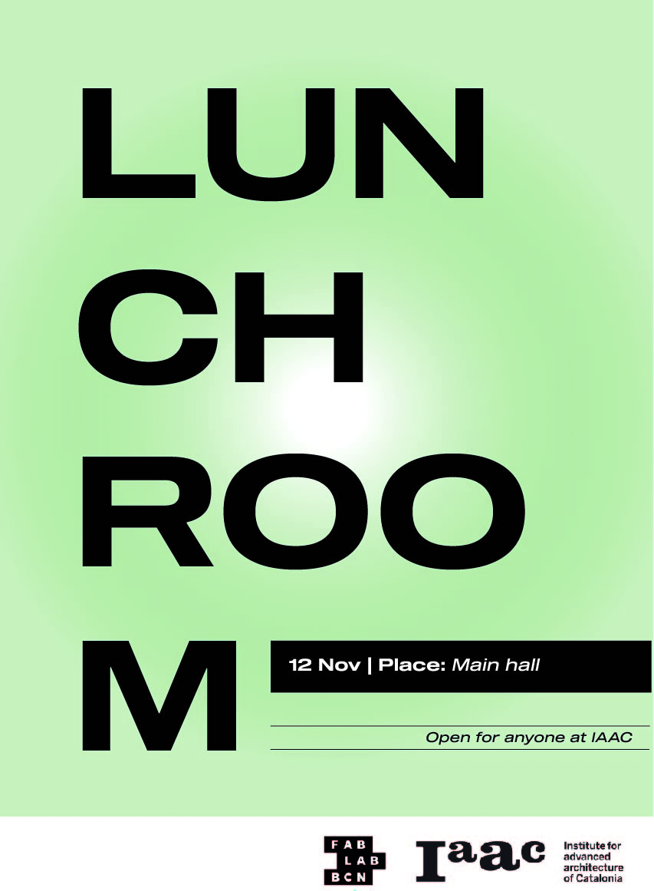
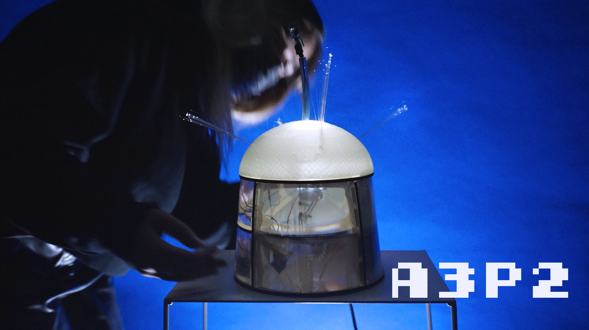
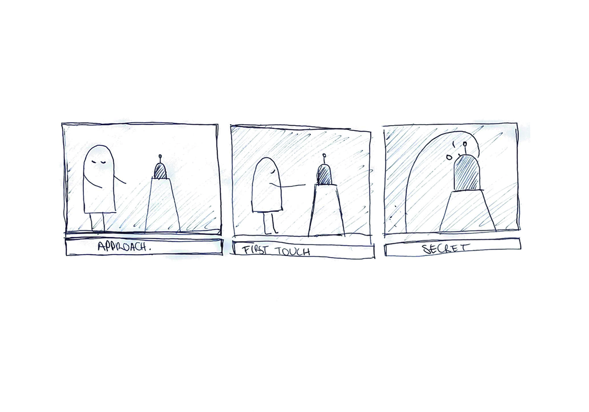

---
hide:
    - toc
---

# Tech beyond the myth

**Forensic Reports**

Forensics of the Obsolescence (iMac2006)

**serial number:**  CK6s0083WH4

**Brand:** Apple (in California)

**Model:** A1195 apple computer

**Color:** White

**Assembled in:** China

**Specifications:** 1.83/2x512/160 combo/Esp 2006
 
**Tested:** Working

**A World in Data**

**Almost useless machine: A3P2**

The whole is greater than the sum of its parts. In A3P2 we worked to develop the structure, the mechanics, and the code according to our skills and the short amount of time we had to design the prototype. Assembling the pieces I realized that the vertical movement or the light system with fiber optics in which I’d been immersed were more than only mechanics and materials, they were a system. Once we had the robot working we couldn't stop projecting human skills to it. At first, we design a machine to feel an emotion by using it, but in the end, I feel that we design a machine to express this emotion. 

<iframe src="https://player.vimeo.com/video/650292328?h=a64379c3d8" width="640" height="360" frameborder="0" allow="autoplay; fullscreen; picture-in-picture" allowfullscreen></iframe>

<a href="https://vimeo.com/650292328">A3P2.mp4</a> from <a href="https://vimeo.com/user30409675">paula del rio arteaga</a> on <a href="https://vimeo.com">Vimeo</a>.

Presentation

