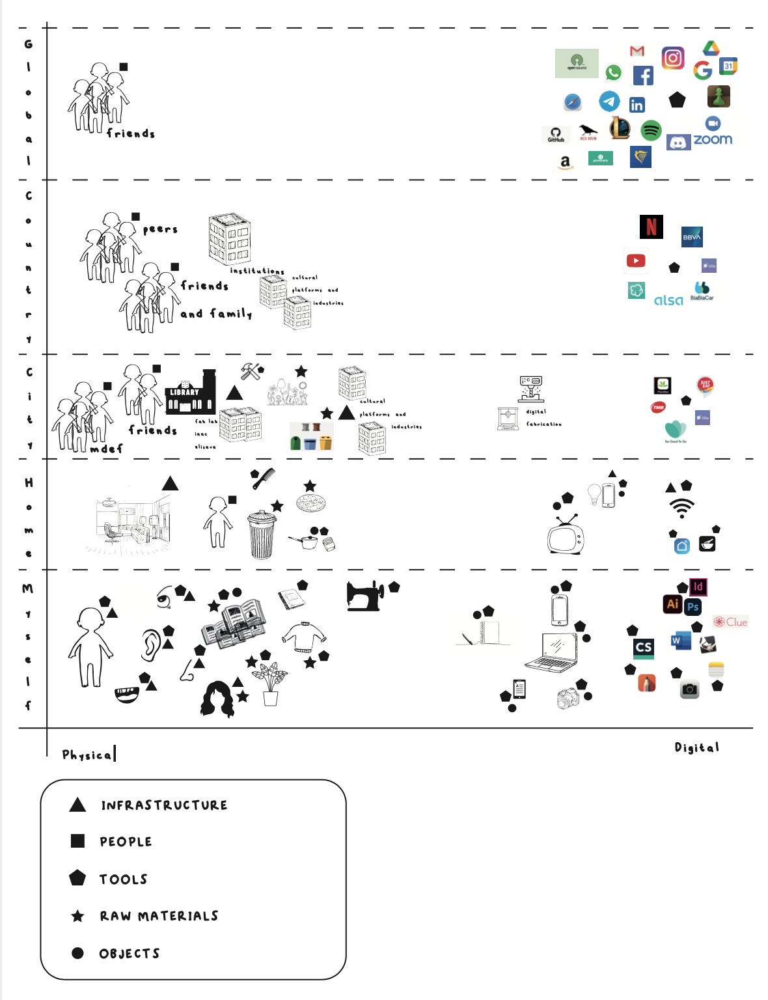
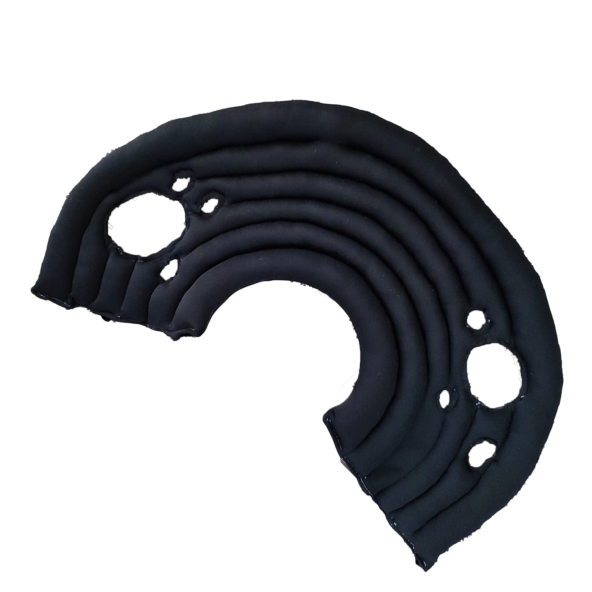
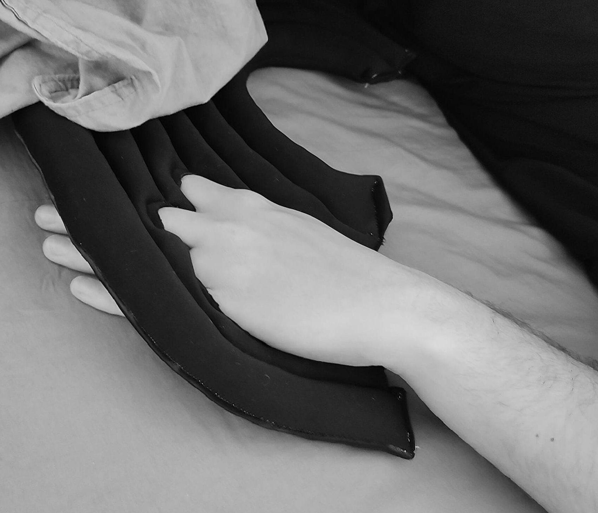

---
hide:
    - toc
---
# Design Studio

# Design Studio I

**Toolbox**

**RESEARCH THROUGH DESIGN TOOLBOX**

The prototype as a means of inquiry for me seems to be one of the most attractive ways to prototype, as well as the prototype as a research archetype. 

As I could see in my toolbox I have so many physical and digital things around me and attached to them my behaviors. 

I wanted to make a physical interface that allows me to change my perception of the moment between I go to bed and I fall asleep. 

Prototype.

# Design Studio II 

Visual documentation

<iframe src="https://player.vimeo.com/video/648603649?h=f2726e9ca3&amp;badge=0&amp;autopause=0&amp;player_id=0&amp;app_id=58479" frameborder="0" allow="autoplay; fullscreen; picture-in-picture" allowfullscreen style="position:absolute;top:0;left:0;width:100%;height:100%;" title="TechVideo.mp4"></iframe>

Video documentation - Tech Beyond the Myth

