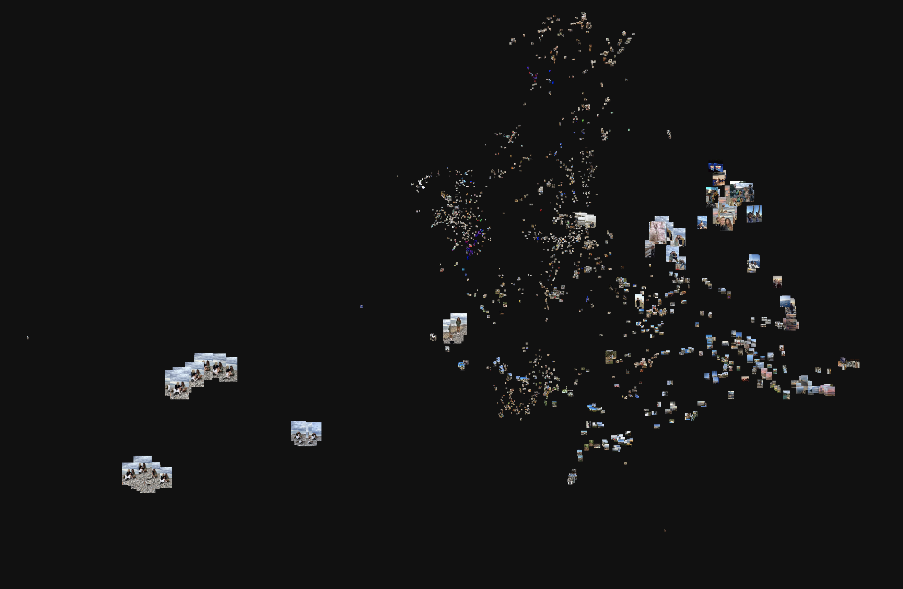
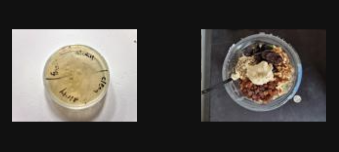
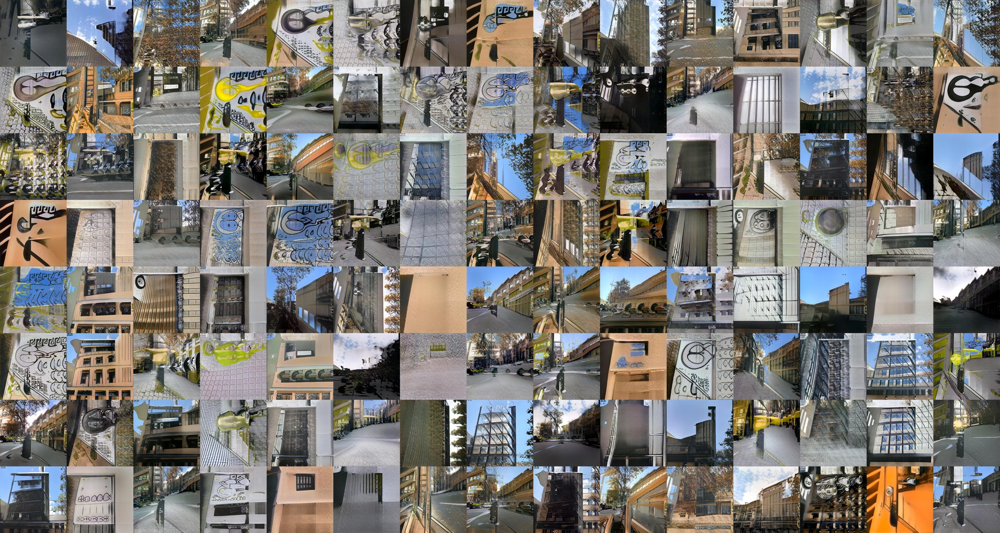
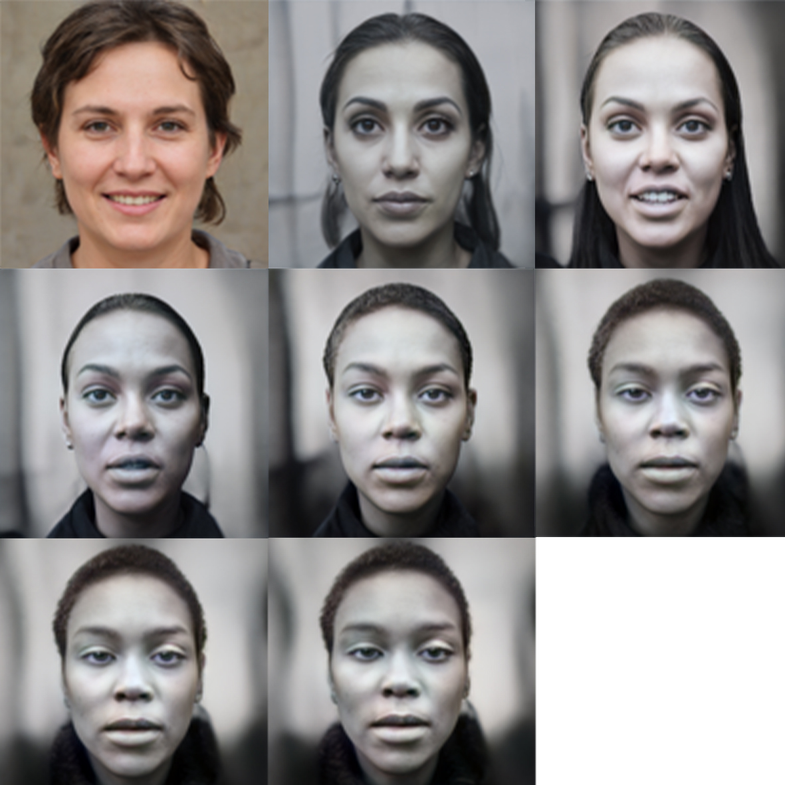

---
hide:
    - toc
---
# Extended Intelligences
## **Week 1**

One of the exercises we had to do was take 100 photos of Poblenou neighborhood, 50 of them of something related to the old Poblenou and 50 with the new one. Also, we had to upload 100 random photos from our phones. Base on these two sets, the professors would generate a map for classifying the images and generate new ones. 

A photo association that I found interesting; the association between shapes and content made the AI put together a Petri dish and a breakfast. 

These are a group of images generated by the AI from the photos of Poblenou.

Then we started to create images by using projects on Google Colab including image identification and generation, latent space, and deep fake. 
The AI generated new faces based on the datasets and we could modify them with parameters. The steps of modification start from an average face with a "no gender" expression and in each step become more strange. 

One thing I found interesting in those projects is mixing two faces.
I uploaded a random photograph and I mix it with Lisa Simpson, and the output was a realistic photo with the man but with some yellow tones. So he seems to be ill. 

**Project end of the week**
This is the [presentation](https://docs.google.com/presentation/d/1-4Eb5VKIGf3kqSfr40TxhLEWaPGLjzwR7zazM_jlasY/edit#slide=id.p) of the project. 

**Starter pack generator** 

The result is an image of a non-existent product. 

## **Week 02**

